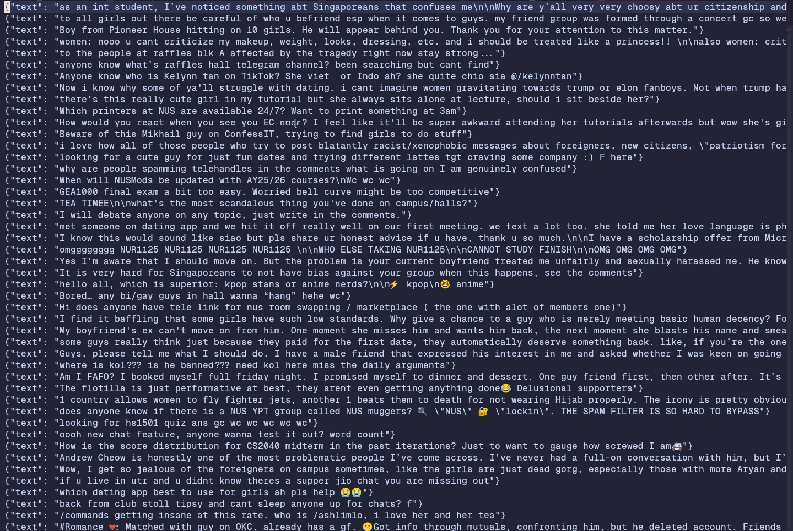

*Figure — Score distribution histogram.*

## Introduction

Live dashboard is up at [confessit.space](https://confessit.space).

NUSConfessIT is a Telegram-based anonymous confession channel serving the NUS community. Since February 2024, it's accumulated over **72,000 confessions**, generating **129 million views** and countless reactions, replies, and discussions.

I've always been an active reader of the channel, and usually I'll learn the latest events and news from it. However, I had the idea to actually scrape and run data analysis on the text posts. In this blog, I'll detail the process from data analysis, machine learning, and eventually - fine tuning!

What are students actually confessing about? Which topics go viral? Can we predict what content will blow up? This analysis uses ML embeddings (OpenAI text-embedding-3-small), UMAP dimensionality reduction, and clustering to map the confession landscape.

### TL;DR

- **Data:** 72k confessions, 129M views.
- **Top finding:** Dating & relationship posts are the most likely to go viral (~32% viral rate).
- **Model:** LightGBM on combined TF‑IDF + embeddings reached AUC ≈ 0.804 after tuning.

### Key findings

- Dating/relationship content has the highest viral rate (~32%).
- TF‑IDF features are the strongest single predictor; embeddings add complementary signal.
- Target leakage and long‑tailed engagement distributions are the main modelling challenges.

## Dashboard


I created a simple Reddit-like dashboard to show all the posts and replies, along with some stats. There's also a search function that allows for simple keyword search. Initially, it was a Flask dashboard to show daily reports, but over time I wanted to deploy on Vercel. This part's a small aside but I was trying to see how capable my Hermes agent was, so I asked:

> /goal refactor the frontend of this project to use next.js, typescript, and tailwind, to be deployed on vercel and hosted on [confessit.anselmlong.com](http:// confessit.anselmlong.com/). use this vercel token if needed,
keep it safe: [REDACTED]. avoid touching anything machine learning or fine tune related. if needed, invoke /frontend-design:frontend-design
or /impeccable:impeccable to improve aesthetics.

And it worked. Amazing stuff! If you hand an agent enough hands it can do probably anything. I don't advise pasting your token in it though (I revoked it after).

## Data Analysis

## At a Glance (As of May 2026)

- **72,172** total confessions
- **129M** total views
- **816** days active
- **23.3** mean composite score
- **11,121** highest score (a whistleblowing STD post, naturally)
- **26%** viral rate (top 25% of posts by score)

## How did I get the data?



I set up a Python scraper to scrape all 72k messages from the channel, and then another one that scraped all the replies as well. These now both run daily as an automated cron job on my server, every 30 minutes. 

## The Score Distribution — A Long Tail of Engagement

While most people see reactions as the sole predictor of virality, I use a weighted score which considers forwards, replies, and reactions. Score here is defined as 3 x forwards + 2 x replies + reactions, where actions with higher effort are more weighted.

Engagement follows a **heavily skewed distribution**. The median post scores just **15**, while the most viral post hit **11,121** — a 740× gap. The top 25% threshold sits at **28**, meaning 75% of all confessions cluster in a narrow low-engagement band.

This is classic social media dynamics: a small fraction of content captures most of the attention. The challenge is identifying *which* posts break through.


*Figure — Category breakdown of confessions.*

## Growth Over Time 


*Figure — Monthly posting activity.*

Since launching in February 2024, the channel has grown from a few hundred posts per month to **sustained volumes of 3,000+ posts monthly**. The peak occurred in late 2024, coinciding with the start of the academic year and major campus events.


## Mapping the Confession Universe


*Figure — 2D UMAP projection of 72K confession embeddings (viral posts highlighted).* 

I then further embedded all 72K confessions using **OpenAI text-embedding-3-small** (512 dimensions), then projected them into 2D using **UMAP (Uniform Manifold Approximation and Projection for Dimension Reduction)**. The resulting landscape reveals a **continuous gradient** rather than hard cluster boundaries — confessions blend into one another along thematic axes.

The left plot shows every post as a dot, with viral posts (top 25%) highlighted in orange. The right plot reveals score intensity — hotter colours indicate higher engagement. Notice how viral posts concentrate in specific regions rather than being uniformly distributed.

### Four main regions — clustering

- **Academics (32%)** — mods, finals, major, course, lecture
- **Career & Hot Takes (31%)** — internship, work, students, linkedin, hustle
- **Dating & Relationships (29%)** — girl, guys, love, crush, friend
- **Lonely & Admin (8%)** — bored, chat, sleep, wanna, swap

The landscape splits into four broad regions, discovered through Mean Shift clustering (bandwidth=2.14) on the UMAP projection and validated against HDBSCAN. The regions are distinct in keyword profile but blend into one another at the boundaries — a semantic gradient rather than hard clusters.

## What Goes Viral

The single most important finding: **dating & relationship content dramatically outperforms everything else**. The viral rate among dating‑region posts is **~32%**, compared to 23–25% for academics and career posts. That's a **40% relative increase** in viral probability.

This makes intuitive sense: anonymous platforms lower the barrier for sharing personal romantic stories that people are reluctant to discuss publicly. The most viral post ever (score 11,121) was a whistleblowing post about a hall resident contracting an STD (famously known as Valor vixens now) — a story that combines romance, scandal, and campus gossip.

> **Key insight:** If you want to go viral on NUSConfessIT, talk about relationships. Romance plus scandal is the most powerful combination. Pure academic complaints and career rants rarely break through the noise.

## Methodology

- **Embedding:** Each confession encoded with `text-embedding-3-small` (512 dimensions).
- **Dimensionality Reduction:** UMAP (15 neighbours, min distance 0.1) fit on 15K sample, transformed across all 72K posts.
- **Clustering:** Mean Shift (bandwidth=2.14) for region detection, validated against HDBSCAN. Four stable regions identified.

## Machine Learning

## Creating a Labelled Dataset

Other than basic data analysis, I realised that we could measure the "goodness" of a post by how many people engaged with it. With the composite score above, I managed to try running both classification and regression models on the data. For regression, it was calculating the exact virality score, and for classification, it was more of taking the top 10k posts as “viral” and setting a reaction threshold to classify the posts into both buckets. 

I had about 72k labelled NUS confessions, and now it was time to run models through it. I asked my personal agent to basically run all the models it could through the data, and to improve the score in whatever way it could.

## Timeline

The prediction pipeline evolved through six iterations, each addressing a specific limitation of its predecessor.

### Version 1 — Baseline. 

A comprehensive survey of 8 classifiers and 6 regressors was conducted using 3,000-dimensional unigram TF-IDF features paired with basic metadata (hour, word count, day of week, and VADER sentiment scores). Models evaluated included Logistic Regression, Complement Naive Bayes, Linear Support Vector Classification, Random Forest, Gradient Boosting, XGBoost, LightGBM, and a multi-layer perceptron. For regression, Ridge, Random Forest, Gradient Boosting, XGBoost, LightGBM, and MLP regressors were tested across raw, log-transformed, and Box-Cox target encodings. LightGBM with a log1p target achieved the best regression performance at a mean absolute error of 5.09 reactions, while Logistic Regression led classification with a macro F1 of 0.499 (bad...).

### Version 2 — Feature Expansion.

I wanted more features. Feature dimensionality was increased to 8,000 dimensions using TF-IDF bigrams. The metadata feature set was expanded to include temporal signals (hour, day of week, month, posting hour recency, weekend flags), textual complexity metrics (Flesch readability score, unique word ratio, punctuation density), stylistic markers (emoji count, capitalisation ratio, exclamation frequency, URL count), and academic calendar features (exam period and recess week indicators). Classification was reframed using quantile-balanced bins. LightGBM's macro F1 improved to 0.515. A faster variant was subsequently produced that dropped the computationally prohibitive MLP regressor and added Huber and Histogram Gradient Boosting regressors.

### Version 3 — Binary Framing & Composite Targeting. 

The prediction task was reframed as binary classification — viral versus non-viral — using a composite virality score: (reactions × 1 +
replies × 2 + forwards × 3) / 6. This weighted formulation reflects signal quality: forwards (sharing behaviour) receive the highest weight as the strongest indicator of amplification, replies capture discussion depth, and reactions are treated as passive baseline engagement. An initial classifier achieved an AUC of 0.799, though this was later found to be inflated by target leakage from a reply_per_word feature. I wanted to predict the virality, but reply_per_word already implies virality.

### Version 4 — Clean Baseline. 

Following identification of the leak, the pipeline was corrected. The decontaminated model achieved an AUC of 0.774, establishing the true performance floor for subsequent improvements.

### Version 5 — Embedding Integration. 

Sentence embeddings (512-dimensional, generated via OpenRouter's API) were introduced as a complementary feature representation alongside existing TF-IDF and metadata. This lifted AUC to 0.795 — a 2.1% relative gain over the baseline.

### Version 6 — Combined Representation & Hyperparameter Optimisation. 

The embedding and TF-IDF feature spaces were combined, and hyperparameter search was conducted over 30 random configurations across eight parameters (maximum tree depth, estimator count, learning rate, subsample ratio, column subsampling, minimum child samples, and L1 and L2 regularisation). Default parameters showed no benefit from combining both representations — both embedding-only and combined pipelines scored 0.796 AUC at default settings. However, hyperparameter optimisation unlocked the
combination: tuned parameters (300 estimators, maximum depth of 10, learning rate of 0.05, subsample of 0.6, L1 regularisation of 0.5, L2 regularisation of 0.1) produced a final AUC of 0.804 with a macro F1 of 0.575 — an aggregate gain of 3.0% over the clean baseline.

Ablation studies confirmed TF-IDF as the dominant feature block, with temporal and stylistic metadata providing moderate independent signal, and sentiment and category features contributing negligible marginal value beyond the combined model.

The final results weren't that good, which is expected since the virality of a confession depends on real world causes and effects which are hard to distill from text.

## Fast Development

Last time, a fine tuning + machine learning pipeline like this might have taken me months. I finished this in 3 days.

What’s different? I used Ava - my Hermes agent which was reachable with my phone and computer. Most of my development work was done from my phone, instructing my agent to change various things, try different models, write fine tuning scripts etc. The only really manual work was running fine tuning on the school’s GPU cluster, as that required VPN access (Fine tuning blog might come soon!)

But the only reason it was this fast is also because I’ve done fine tuning and machine learning before, the terminology isn’t new and I know where to steer the model. Still - a great and fun learning experience and I can’t wait to see what other insights I can extract from the data!

## Possible Extensions

There are many things I could probably do with the data. One idea is a searchable vector database - the current search only does keyword matching, but I'm sure semantic search can be done. I've also done fine tuning on the data, but that will be released in another blog! Unfortunately I can't serve that to the public due to GPU costs. I think an interactive visualizer for the clustering would be very interesting to watch.

## Glossary

## Understanding the feature set

### TF-IDF (Term Frequency–Inverse Document Frequency)

A numerical statistic that measures how important a word is to a specific
document within a larger collection. It balances two factors: how often a word
appears in a post (frequency) and how rare it is across all other posts
(rarity). A word like "capybara" will score high if it appears in only one
confession; a word like "school" will score low because it's everywhere. TF‑IDF
turns unstructured text into a structured numerical representation models can
work with. In the recent confessions, I'm sure "pencil" and "pencil cases" will score low LOL.

### Unigram vs Bigram

A unigram looks at single words in isolation. A bigram looks at pairs of
consecutive words and can capture short-range context that unigrams miss —
for example, "not good" carries a different meaning from "good". Our final
model used bigrams with a vocabulary of 8,000 features. (bye-grams btw not big-rams)

### Sentence embeddings

While TF‑IDF measures word importance, embeddings capture semantic meaning.
Each sentence is converted into a 512-dimensional vector so semantically
similar sentences cluster together in vector space. "I'm so stressed about
exams" and "exams are killing me" end up near each other even if they share
few exact words, which helps the model generalise beyond exact keyword
matching.

### Metadata features

- **Temporal signals:** hour of posting, day of week, month, night flag (after
  10pm or before 6am), and weekend flag. These capture behavioural patterns —
  students posting at 3am might be more emotionally charged.
- **Text statistics:** word count, character count, average word length, line
  count, unique word ratio.
- **Stylistic markers:** emoji count, capitalisation ratio, exclamation count,
  punctuation density, presence of a question, URL count.
- **Readability:** Flesch Reading Ease score.
- **Academic calendar:** binary flags for exam periods and recess weeks at NUS.
- **Sentiment scores:** VADER outputs (positive, negative, neutral, compound).

### Category encoding

Each post carries a category tag extracted from its header (e.g. `#Studies`,
`#Romance`, `#Rant`). These are one‑hot encoded: each category becomes its own
binary column (if a post is `#Romance`, the Romance column = 1, others = 0).

## Understanding the target

### Virality score

Rather than predicting raw reaction counts, we constructed a weighted composite
score:

```
virality_score = (reactions × 1 + replies × 2 + forwards × 3) / 6
```

Forwards indicate active sharing (strongest signal); replies indicate deeper
discussion; reactions are the passive baseline. Dividing by 6 keeps the score on
a similar scale to the original reaction counts.

### Viral label

For classification we binarised the target: any post with a virality score at or
above the 75th percentile is labelled **viral** (1); everything below is
**non‑viral** (0). Framing the problem this way is more robust than predicting
exact counts, which are noisy.

## Understanding the models

- **Logistic Regression:** a fast, interpretable linear classifier used as a
  baseline.
- **Complement Naive Bayes:** a Naive Bayes variant suited for imbalanced
  text classification; estimates class probabilities from word frequencies.
- **Linear SVC:** a linear support vector classifier that maximises margin;
  often produces a cleaner separation than logistic regression.
- **Random Forest:** an ensemble of decision trees (100 trees here). It
  performs poorly on very high‑dimensional sparse TF‑IDF features.
- **Gradient Boosting / XGBoost / LightGBM:** sequential tree learners. LightGBM
  (leaf‑wise growth) was the top performer for our sparse text + metadata
  representations.
- **MLP (Multi‑Layer Perceptron):** a basic neural network (single hidden
  layer of 128 neurons) — it struggled with 8,000‑dimensional TF‑IDF on CPU.
- **Ridge Regression / Huber Regressor:** linear regressors with L2 and
  robust loss respectively; useful baselines for regression tasks.

## Understanding the metrics

- **MAE (Mean Absolute Error):** the average absolute difference between
  predicted and actual reaction counts. An MAE of 5.09 means the model is off
  by ~5 reactions on average.
- **F1 Score:** the harmonic mean of precision and recall. Macro‑averaged F1
  treats classes equally regardless of size.
- **AUC / ROC‑AUC:** the probability the model ranks a random viral post above
  a random non‑viral post. AUC = 0.804 means ~80.4% chance of correct ranking.

## Key concepts

### Target leakage

Target leakage occurs when a feature encodes information about the target that
wouldn't be available at prediction time. For example, `reply_per_word`
contains reply counts observed after publication and artificially inflated our
initial AUC (0.799 → 0.774 after removing the leak).

### Hyperparameter optimisation

We performed a randomized search (30 iterations) over eight LightGBM
hyperparameters (tree depth, learning rate, estimators, subsample ratios,
L1/L2 regularisation, min child samples). Default LightGBM gave AUC ≈ 0.796;
after tuning we reached 0.804 with deeper trees and stronger regularisation.

### Log transformation (`log1p`)

Long‑tailed reaction counts are compressible with log(reactions + 1). For
example, 2 → ~1.1, 50 → ~3.9, 383 → ~5.9. Models predict in the compressed
space and predictions are exponentiated back to the original scale. Box‑Cox is
a generalisation that learns the optimal transformation from data.

### Ablation study

Systematically removing feature groups showed TF‑IDF features were the most
important signal. Temporal and stylistic metadata added moderate value; sentiment
and category encodings contributed negligible marginal gain beyond the combined
model.