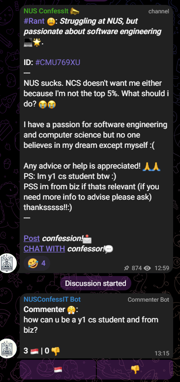
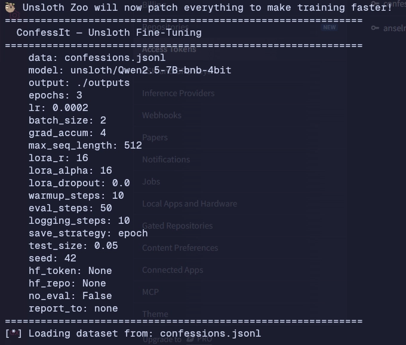
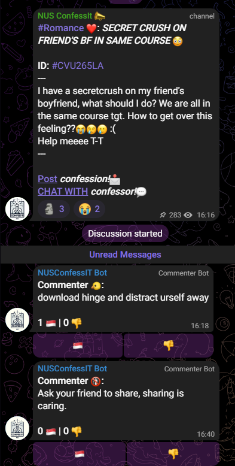

72,279 anonymous confessions. Half a million reactions. A fine-tuned language model that learned to sound like a student venting at 2 AM.

This is the story of how a Telegram channel scraping project turned into an Unsloth fine-tuning pipeline — and the unexpected dynamic of building everything through back-and-forth with a coding agent.

---

## How It Started

It began simply enough. NUSConfessIT is a massive part of campus culture — everyone reads it, nobody admits to submitting. I wanted to scrape it, store it, and see what patterns emerged. 

But here's the thing about data: once you have 72K posts sitting in a SQLite database, you start wondering what else you can do with them. And since I had fine tuning experience, and access to a GPU cluster, "train a model to generate its own confessions" is a pretty natural next step.

---

## The Data Pipeline

The raw data lives in `data/messages.db` — a SQLite database with a `messages` table. Each row has the post's clean body text, metadata, and engagement stats. But not every post is worth training on, so I built an export script that applies a few filters:

- **reply_count >= 6** — only posts that actually got discussion. If nobody bothered to reply, it's probably not representative.
- **length between 20 and 2000 characters** — too short and it's noise or a single emoji. Too long and it's a wall of text that breaks the style.
- **alpha ratio >= 0.3** — filters out posts that are mostly links, numbers, or emoji soup. I wanted actual writing.
- **bot footer stripped** — every confession has an auto-appended footer from the Telegram bot: "✍️ Click here to confess" or "👇 Comment below."

The output format is pure causal LM — `{"text": "..."}`. No chat templates, and no system/user/assistant roles like my last model. Just raw confession text, one per line. This allows the model to learn the voice of ConfessIT.

---

## The Fine-Tuning: Unsloth + Qwen 2.5 7B

### Why Qwen 2.5?

I'd used Mistral-7B for a previous fine-tuning project (Almost Anselm, cloning my Telegram personality). This time I wanted to try Qwen 2.5 — it's been consistently strong on Chinese and English text, handles informal language well, and the 4-bit quantized version from Unsloth fits comfortably on most GPUs.

### The Setup

| Parameter | Value |
|-----------|-------|
| Base model | `unsloth/Qwen2.5-7B-bnb-4bit` |
| Format | Causal LM (single `text` field) |
| LoRA rank | 16 |
| LoRA alpha | 16 |
| Target modules | All linear projection layers |
| Batch size | 2 per device |
| Gradient accumulation | 4 steps (effective batch: 8) |
| Learning rate | 2e-4 |
| Epochs | 3 |
| Max sequence length | 1024 tokens |

Initially, I wanted a **512 token context** was intentional. Confessions are short — usually a paragraph at most. However, some confessions exceeded it and gave me a headache so I just put it as **1024**. 

The **LoRA rank of 16** with alpha 16 is a conservative choice. Rank 32 or 64 would give the adapter more capacity, but for a single style transfer task like this, rank 16 is plenty.

Targeting **all linear projection layers** (q_proj, k_proj, v_proj, o_proj, gate_proj, up_proj, down_proj) is standard practice now.

### The Training Run



Previously, I ran fine-tuning on Axolotl (and there was a cute ASCII axolotl), this time it was Unsloth (and a cute ASCII sloth!). I ran this on NUS's compute cluster with one of their GPUs, using the Unsloth notebook (`unsloth-finetune.ipynb`). The flow was:

1. Upload the cleaned JSONL file to the NUS server (`xlogin.comp.nus.edu`) (For a longer guide about the NUS Compute Cluster, refer to [this blog](https://anselmlong.com/blog/almost-anselm))
2. Load the 4-bit base model via Unsloth's FastLanguageModel
3. Inject LoRA adapters
4. Run SFTTrainer from TRL
5. Push the adapter to HuggingFace Hub

The whole thing ran overnight (something messed up the first time so I had to do it over 2 nights) for 3 epochs on ~9K training samples.

## Results

The output was convincing enough that I couldn't always tell the generated text from real confessions at a glance. The model picked up on the characteristic patterns — the way students talk about NCS, the general loneliness of NUS students, and the love for scandals and tea.

I had to seed the model with a prompt, and generated a few confessions. They did sound really real, if not for a few language mistakes and inconsistencies. I posted 2 on NUSConfessIT to see if they would actually get reactions, and they got a few within 30 minutes. It's kinda funny to see how the model actually picks up on the NCS discussions and the bias towards computer science and romance confessions.

Some example confessions:
```
── Prompt ──
pen

── Generation 1 ──
penultimate year soc student here, anyone knows which mods to take for sep and why? (planning on doing stats or data science) thanks in advance 🙏🏻🙏🏼🔥🫡✨:) )! pls dm me as well if you h   have any recommendations of places that offer these courses/ modules!! i am so lost 😭😭😢🥲🥺💀☠️🤡🗿🌚👽👾💩-svg 🔥 fire emoji is the highest priority pleasee!!! thank u all :)  ᓹᘎᕝᖅᗋᓿᐦᙩᑑ [[…]⁰ ⬛ ▶▶ ◀

── Prompt ──
girl

── Generation 1 ──
girl, 23yo here. i've been feeling very depressed recently because of my financial situation.

my parents are divorced and only me (brother is already married) stay with dad now.
dad has a stable job so he's not really struggling financially but the problem lies in how much hes willing to give us each month for expenses like food or our own personal savings

this money doesn't even come from his salary it comes directly by him selling stocks on binance
at first I was happy that we had some sort source as an emergency fund when needed however after watching what happened just this year ive become worried if one day everything will be gone once again.. especially since im still young & dont have any other investment plans/ways out yet...

anyway long story short: its making life stressful at times cause you always live under fear + anxiety where your safety net can disappear without warning 🥲🥸🥺
if anyone wants advice please reachout Imma girlie who needs all kinds o help omggg😭🙏🏻 thank u! <(｡•́‿ •̀。)> ❌ �

── Prompt ──
cs

── Generation 1 ──
cs 2043 and ma1526 are absolutely horrible. profs know how bad theyre teaching but dont care about the students at all, it feels like you have to suffer through this as a necessary evil just so that u can graduate on time 😭😭 im dreading next sem because i heard those mods coming back again for my major 🥲🥱 what am I supposed do? 💀💀 help pls guys 👍👎🙏🏼🔥🤯

imagine taking cs+math+dsa majors + biz degree here.. oh wait its me... life is hard broo

just wanted yall t feel better during exam season by complaining with us ☺️☺️
- an anonymous student in nus computing (and business) 🔮🤷 ♂︎💔🧟🫡👨🏻
👍 | ❤️

── Prompt ──
cs

── Generation 1 ──
cs 2031 is too ez, how many marks do u guys think i can get for the midterms? just wanna know if my study plan was good enough. (I finished all tutorial and pract exam papers with >85% before today’s midterm)

midterm:
- Qn4 easy
-Qns7a,b,c,d,e,f,g,h,i,j,k,l I got some wrong but mostly correct

any tips on what to revise more deeply/take a look at after finals thxx!! 🙏🏻🙏🏽🫶🏼🥲🥺❤️🥰:)

── Prompt ──
a

── Generation 1 ──
a 20-something who is a virgin and have no experience in dating? anyone else feeling the same way… im so alone 😢😢 wcwcw cccc I just wanna find someone special 🙏🏻🙏🏼 i cant wait to feel
that connection with another human being like how we see on movies. it makes me want cry😭 my life feels empty without any romantic experiences, all those moments are only from books or shows.. what do u think guys/girls can you relate?? help pls :) :)) )) ))

❤️ - yes
👎 –no
🔥- gay (im not but why this option even exist)
💔– others / leave comment below! please let’s talk about these feelings together!!! ♥︎♥♡🫡🥰💕 ：D ＋＋（hugs)

```

Okay some gibberish at the ends, but some are scarily accurate. Love how the model picked up on wc (to hit word count), and the polls.




This one was pretty funny, and I got a DM even.


This also got 3 comments!

## Reflections

Unsloth is a pretty good framework! Trained stuff pretty fast, honestly probably didn't need overnight but I was tired. Learnt a lot overall about turning a noisy data source into something that captured the essence of NUSConfessIT - even getting reactions.

---

The fine-tuned adapter is on HuggingFace at (anselmlong/confessit)[https://huggingface.co/anselmlong/confessit/tree/main], the full pipeline is [open source](https://github.com/anselmlong/confessit-scraper), and the dashboard is [live](https://confessit.space). If you're an NUS student curious about ML, clone the repo and try generating your own confessions. The model's free to run on a Colab — and the data's already there.

Enjoy!
